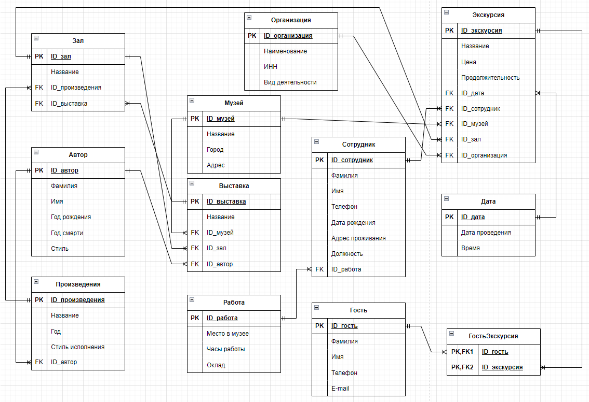

# Задача "Сформировать структуру базы данных для музея"
1. Посетить любой музей в вашем городе. Сделать фотоотчет (фото музея, себя на фоне музея/внутри музея)
2. Составить в экселе базу данных со следующей структурой: название таблиц, название полей, название параметров, описание полей, описание параметров. База данных должна включать не менее 30 таблиц!
3. Нарисовать взаимосвязи таблиц (miro/draw.io/excel).

4. Написать сценарий использования созданной базы данных.

# Выполнение задачи:
В качестве музея был посещен **[Екатери́нинский дворе́ц](https://tzar.ru/objects/ekaterininsky)**, также известный как Государственный музей-заповедник "Царское село" в г. Санкт-Петербург (г. Пушкин, ул. Садовая, д.7)

### Фотоотчет:

Составлена база данных в музее в виде диаграммы Draw.io, которая имеет следующий сценарий:

* База данных позволяет отслеживать когда и в какое время какой гость посетил ту или иную экскурсию
* Где проходила экскурсия, в каком зале, кто был экскурсоводом, либо организацией, проводящей экскурсию
* В каком зале расположены какие произведения, кто автор этих произведений, в каком стиле они написаны
* Какие сотрудники работают в музее, в каких должностях, с какой зарплатой и где они фактически на месте осуществляют свою трудовую деятелность.

## К файлу прикреплена диаграмма со связями баз данных в Draw.io
